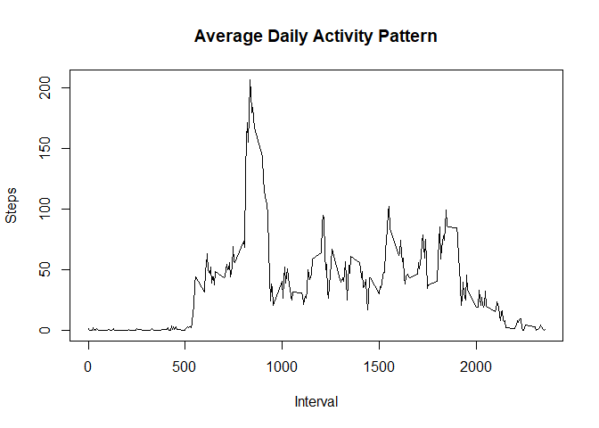

## Loading and preprocessing the data

```r
activity <- read.csv("activity.csv", header = TRUE)
```
## Exploring the basics of this data

```r
dim(activity)
```

```
## [1] 17568     3
```

```r
names(activity)
```

```
## [1] "steps"    "date"     "interval"
```

```r
head(activity)
```

```
##   steps       date interval
## 1    NA 2012-10-01        0
## 2    NA 2012-10-01        5
## 3    NA 2012-10-01       10
## 4    NA 2012-10-01       15
## 5    NA 2012-10-01       20
## 6    NA 2012-10-01       25
```

```r
str(activity)
```

```
## 'data.frame':	17568 obs. of  3 variables:
##  $ steps   : int  NA NA NA NA NA NA NA NA NA NA ...
##  $ date    : Factor w/ 61 levels "2012-10-01","2012-10-02",..: 1 1 1 1 1 1 1 1 1 1 ...
##  $ interval: int  0 5 10 15 20 25 30 35 40 45 ...
```

```r
#total number of missing data
sum(is.na(activity$steps))/dim(activity)[[1]]
```

```
## [1] 0.1311475
```

```r
#transforming the date column into date format using lubridate
library(lubridate)
activity$date<-ymd(activity$date)
length(unique(activity$date))
```

```
## [1] 61
```
## What is mean total number of steps taken per day?

```r
StepsPerDay <- tapply(activity$steps, activity$date, sum)
hist(StepsPerDay, xlab = "Number of Steps", main = "Histogram: Steps per Day")
```

<!-- -->
## Mean and median number of steps taken each day

```r
MeanPerDay <- mean(StepsPerDay, na.rm = TRUE)
MedianPerDay <- median(StepsPerDay, na.rm = TRUE)
```
The `mean` is 1.0766189\times 10^{4} and the `median` is 10765.
## What is the average daily activity pattern?

```r
StepsPerInterval <- tapply(activity$steps, activity$interval, mean, na.rm = TRUE)
plot(as.numeric(names(StepsPerInterval)), 
     StepsPerInterval, 
     xlab = "Interval", 
     ylab = "Steps", 
     main = "Average Daily Activity Pattern", 
     type = "l")
```

<!-- -->
### The 5-minute interval that, on average, contains the maximum number of steps

```r
maxInterval <- names(sort(StepsPerInterval, decreasing = TRUE)[1])
maxSteps <- sort(StepsPerInterval, decreasing = TRUE)[1]
```
The `5-minute interval`, on average across all the days in the data set, containing the maximum number of steps is 835.
## Imputing missing values

```r
missing.vals <- sum(is.na(activity$steps))
```
## Devise a strategy for filling in all of the missing values in the dataset
I will fill in missing data with the mean number of steps across all days with available data for that particular interval.

## Creating new dataset with the missing data filled in

```r
StepsPerInterval <- tapply(activity$steps, activity$interval, mean, na.rm = TRUE)
# split activity data by interval
activity.split <- split(activity, activity$interval)
# fill in missing data for each interval
for(i in 1:length(activity.split)){
    activity.split[[i]]$steps[is.na(activity.split[[i]]$steps)] <- StepsPerInterval[i]
}
activity.imputed <- do.call("rbind", activity.split)
activity.imputed <- activity.imputed[order(activity.imputed$date) ,]
```
## Histogram of the total number of steps taken each day after missing values are imputed

```r
StepsPerDay.imputed <- tapply(activity.imputed$steps, activity.imputed$date, sum)
hist(StepsPerDay.imputed, xlab = "Number of Steps", main = "Histogram: Steps per Day (Imputed data)")
```

<!-- -->


```r
MeanPerDay.imputed <- mean(StepsPerDay.imputed, na.rm = TRUE)
MedianPerDay.imputed <- median(StepsPerDay.imputed, na.rm = TRUE)
```
The mean and median number of steps per day including imputed data are 1.0766189\times 10^{4} and 1.0766189\times 10^{4}, respectively. The mean remains the same as prior to imputation, while the median value increased slightly.
## Are there differences in activity patterns between weekdays and weekends?

```r
activity.imputed$day <- ifelse(weekdays(as.Date(activity.imputed$date)) == "Saturday" | weekdays(as.Date(activity.imputed$date)) == "Sunday", "weekend", "weekday")
# Calculate average steps per interval for weekends
StepsPerInterval.weekend <- tapply(activity.imputed[activity.imputed$day == "weekend" ,]$steps, activity.imputed[activity.imputed$day == "weekend" ,]$interval, mean, na.rm = TRUE)
# Calculate average steps per interval for weekdays
StepsPerInterval.weekday <- tapply(activity.imputed[activity.imputed$day == "weekday" ,]$steps, activity.imputed[activity.imputed$day == "weekday" ,]$interval, mean, na.rm = TRUE)
```
### Panel plot comparing the average number of steps taken per 5-minute interval across weekdays and weekends

```r
# Set a 2 panel plot
par(mfrow=c(1,2))
# Plot weekday activity
plot(as.numeric(names(StepsPerInterval.weekday)), 
     StepsPerInterval.weekday, 
     xlab = "Interval", 
     ylab = "Steps", 
     main = "Activity Pattern (Weekdays)", 
     type = "l")

# Plot weekend activity
plot(as.numeric(names(StepsPerInterval.weekend)), 
     StepsPerInterval.weekend, 
     xlab = "Interval", 
     ylab = "Steps", 
     main = "Activity Pattern (Weekends)", 
     type = "l")
```

<!-- -->
